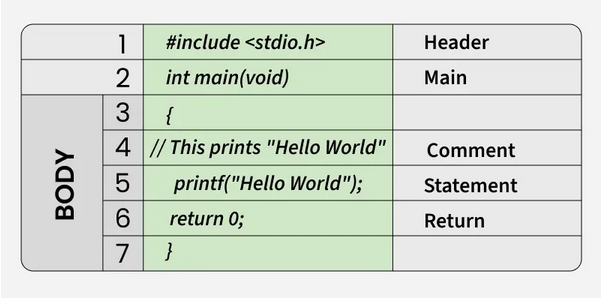

# Introduccion a C

C es un lenguaje de programacion procedural, proposito general, desarrollado inicialmente por `Dennis Ritche` en 1972 en los laboratorias Bell de AT&T. Fue creado inicialmente como lenguaje de programacion del sistema operativo UNIX.

## Porque aprender C? 

C es la mama de todos los lenguajes de programacion, ya que algunos de estos se basan en C ya sea sen sintaxis o caracteristicas o indirectamente como C. Vease como la sintaxis de java, php o javascrip.

Se dice que si una persona aprender primero C, podra dominar cualquier lenguaje de programacion moderno y tambien le proporcionara una comprension mas profunda de los fundamentos de programacion y la arquitectura subyacenete del sistema operativo, como punteros D:, oubucaciones de memoria.


### Ejemplo de un simple programa en C

```c

#include <stdio.h>

int main() {
    // Estos imprime "Hola Mundo"
    printf("Hello Jakepys :D");
    return 0;
}
```


## Estructura del programa en C 

C tiene una estructura clara, se debe respetar, ya que cualquier otra forma de escribir un programa en C probocaria un error en tiempo de compilacion.

Su estructura es la siguiente.




#### Archivos de encabezado: line 1 `[#include <stdio.h>]`
El primer componente son los archivos de encabezado de un programa en C. Un archivo de encavezado es un archivos que tiene la extencion `.h` que contiene varios archivos fuente. 

Entonces, todas las lineas que empienzan por `#` son procesadas por un preprocesador, que un programa que es invocado por el compilador.

Ejemplos de archivos de encabezado en C:
- `stddef.h`: define varios tipos y macros utiles
- `stdint.h`: define tipos enteros de ancho exacto
- `stdio.h`:  defina las funciones principales de entrada y salida
- `stdlib.h`: define funciones de conversion numerica, generador de numeros pseudoaleatorios y asignacion de memoria
- `string.h`: define funciones de menejo de cadenas
- `math.h`:  define funciones matematicas comunes, como es sen o cos 

#### Declaracion del metodo principal - `[int main()]`

Es el punto de entrada de cualquier programa en C y su ejecucion comenzara con la linea de `main()`.

Nota: Esto era válido para versiones anteriores de C, pero se ha modificado en C11 (y versiones más recientes). En versiones más recientes, foo() es igual que foo(void).

```cpp
// c++
int main()
{
    /**/
    return 0;
}
```

```cpp 
int main(void)
{
    /**/
    return 0; 
}
```

##### Cual es la diferencia?
En `c++`, no hay diferencia; ambas son iguales. Ambas definiciones funcionan en C, pero la segunda definicion con void se consifera tecnicamente mejor, ya que especifica claramente que la funcion principal solo se puede llamar sin ningun parametro.

El int escrito ante antes de `main()` indica el tipo de retorno de `main()`. El valor devielte por `main()` indica el estado de finalizacion.


#### Cuerpo principal `[entre {}]`
Puede ser cualquier cosa que tome el stdout o el stdin.

#### Declaracion de retorno `[return 0;]`
la sentencia de retorno devuelve el valor de main(). El sistema operativo puede utilizar este valor para determinar el estado de finalización del programa. El valor 0 generalmente significa una finalización exitosa.


