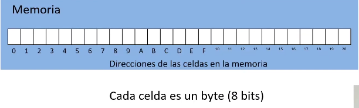
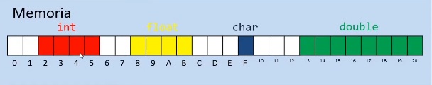
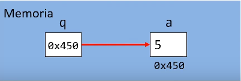

# Punteros


## Memoria - Organizacion
Una maquina tipica tiene un arreglo de celdas de memoria numerados o 
direccionados de forma consecutiva que pueden ser manipuladas de forma 
individual o en grupos contiguos.




## Tamanio de los tipos de datos
Cada tipo de dato primitivo (`int`, `char`, `float`, `double`) ocupa un ciarto
numero de celdas en la memori. Si queremos sber cuntos bytes ocupa un tipo de dato
o arreglos de tipos de datos, contamos con la funcion `sizeof()`.



```c
#include<stdio.h>

int main() {
    char a; printf("char: %d\n", sizeof(char));
    int b; printf("int: %d\n", sizeof(int));
    long c; printf("long: %d\n", sizeof(long));
    float d; printf("float: %d\n", sizeof(float));
    double e; printf("double: %d\n", sizeof(double));
    long long f; printf("long long: %d\n", sizeof(long long));
    int g[5]; printf("int g[5]: %d\n", sizeof(g));
    return 0;

}
```

## Punteros resumen
El puntero es una variable cuyo contenido es la direccion de otra variable.

```
Dos operaciones importantes son: &(para obtener la direccion de una variable), y *
para acceder a la variable apuntada por el nuevo puntero.
```

```c
int a = 5;
int *q; // Se declara un puntero a int 
q = &a; // guardamos la direccion de a en q.
*q = 10; // modificamos el valor de a 
```


