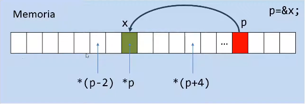

# Aritmetica de punteros

- En eta img cada celda es un int o puntero a int.

Si sumamos o (restamos) un valor entero a un puntero, estamos
adelantando (o atrasando) al puntero en una cantidad de bytes de 
acuerdo al tipo de dato del puntero. Esto nos servira, entre otras cosas,
para acceder a elementos de vectores o matrices!

La canatidad de saltos va ser proporcional al tipo de dato al que apunte el puntero. 
Si es char 1 bytes 
Si es double 8 bytes 
Si es int 4 bytes 
